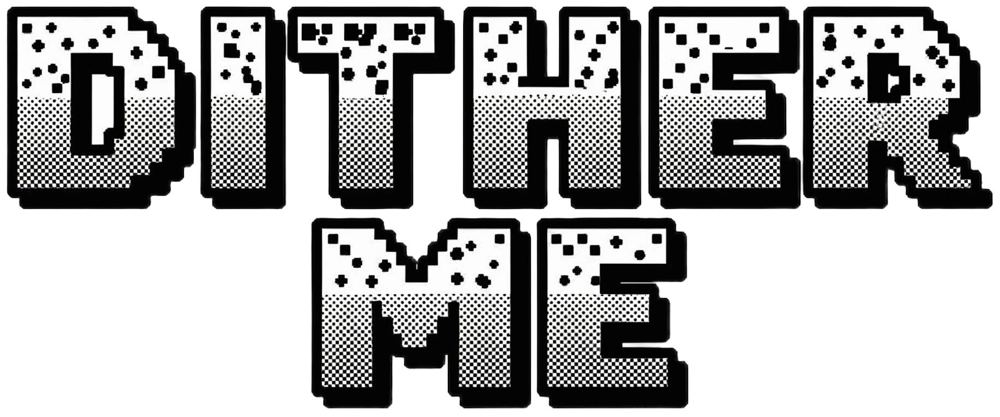

<div style="display:flex;flex-direction:column;align-items:center;gap:14px;margin-bottom:20px">

</div>


A modern WebGL-powered tool for applying retro dithering effects to your images. Transform your photos into pixel art-style images with various dithering algorithms and color palettes.

## Features

- **Process locally**: All image processing runs entirely in your browser using WebGL, ensuring your images never leave your device.
- **Multiple dithering algorithms**:
  - Bayer dithering (2x2, 4x4, and 8x8 matrices)
  - Floyd-Steinberg error diffusion
  - Ordered dithering
- **Color palette options**:
  - Black and white
  - CGA palette
  - Gameboy colors
  - Custom color palettes
- **Image preprocessing**:
  - Contrast adjustment
  - Highlights and midtones control
  - Brightness threshold adjustment
- **Performance optimizations**:
  - Optional downsampling for large images
  - Hardware-accelerated processing using GPU
  - OffscreenCanvas support for better performance (when available)

## How to Use

1. Upload an image using the image upload area
2. Adjust dithering options:
   - Select dithering algorithm (Bayer, Floyd-Steinberg, Ordered)
   - Choose color palette or create custom palettes
   - Adjust image preprocessing settings
   - Set optional downsampling for faster processing
3. View the preview in real-time
4. Download the processed image

## Technical Details

The application is built using:
- Shadcn UI for the UI components
- WebGL for GPU-accelerated image processing
- Tailwind for styling

### How It Works

1. Images are loaded and optionally downsampled
2. WebGL shaders apply the selected dithering algorithm
3. For Floyd-Steinberg dithering, a two-pass rendering approach is used:
   - First pass: Calculate quantized colors and errors
   - Second pass: Apply error diffusion
4. The final image is rendered to canvas and can be downloaded

## Development

### Installation
```
pnpm install
```

### Development Server
```
pnpm dev
```

### Building for Production
```
pnpm build
```

## Further plans

- [ ] Switch to UnoCSS
- [ ] Process images in worker & offscreen-canvas for better performance

## License

This project is licensed under the [Apache License 2.0](https://www.apache.org/licenses/LICENSE-2.0).


## Acknowledgements

- [The Art of Dithering and Retro Shading for the Web](https://blog.maximeheckel.com/posts/the-art-of-dithering-and-retro-shading-web/)
- [Color Quantization and Dithering - Youtube](https://www.youtube.com/watch?v=8wOUe32Pt-E)
- [glsl-dither - GitHub](https://github.com/hughsk/glsl-dither)
- [GLSL dithering](https://devlog-martinsh.blogspot.com/2011/03/glsl-dithering.html)